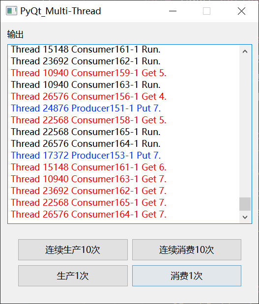
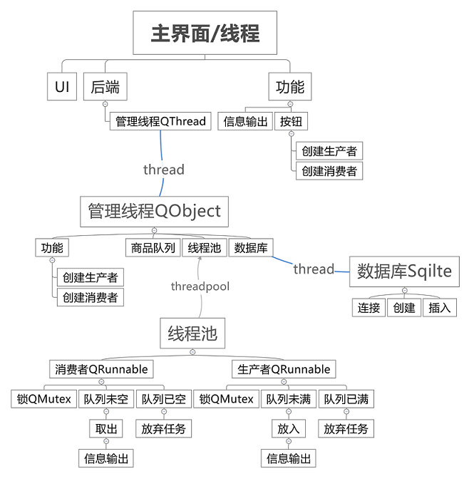

# PyQt Multi-Thread 多线程

[](https://github.com/Yundi339/PyQt_Multi-Thread) [](https://github.com/Yundi339/PyQt_Multi-Thread) [](https://github.com/Yundi339/PyQt_Multi-Thread)

## 简介

最近重新学了`Qt`多线程，对多线程的逻辑有了新的认识，这个程序的代码量不多，主要侧重点在设计方面，因为设计问题我代码改版了三次，花费近两周时间才完成并且修复了所有测试的bug。(PS:如果有人对这份代码感兴趣，并且运行后发现bug，可以告知我及时修正它)

该项目应用在解决`生产者消费者`问题（并没有完全解决），我认为`生产者消费者`问题存在一些功能不明确的问题，因此我只是解决了大部分我能想到的情况，这个缺点我会在后面具体描述。

> 涉及技术


| 技术     | 库                     |
| :--------- | :----------------------- |
| `界面UI` | Qt Designer            |
| `多线程` | QThread, QObject       |
| `线程池` | QThreadPool, QRunnable |
| `数据库` | Sqlite3                |

## 文件结构

|── main.py - 程序入口</br>
|── UI.py - Ui界面</br>
|── MainWindow.py - 界面功能</br>
|── ThreadManage.py - 后台线程</br>
|── TaskConsumer.py - 消费者</br>
|── TaskProducer.py - 生产者</br>
└── untitled.ui - QtUi文件</br>

## 环境

兼容`PyQt5`和`PyQt6`，你可以安装其中任意一个版本

```commandline
pip install pyqt5
```

```commandline
pip install pyqt6
```

## 界面



## 设计

这份代码我重构了三遍，前两遍都是因为对`Qt`多线程的无解

### QThread

我使用的是更加规范的多线程写法`moveToThread`，让UI和业务分离，可以让线程在后台一直处于等待消息的状态。

线程通过`Signal-Slot`实现线程间交互，同时我也对线程做了优化，程序不会因为跨线程操作而导致界面崩溃。

### QThreadPool

我使用的是2个线程池来实现生产者、消费者，并通过队列来实现数据存取，通过按钮来触发对应任务。

任务中使用各自对应的锁来保证线程安全和队列的安全存取。

### Sqlite3

我加入了数据库`Sqlite`，这是`Python`自带的数据库，因为`Sqlite`设为禁止跨线程调用，因此我将数据库操作放在了单线程中，如果触发数据库操作，将会将操作发送到消息队列中，我也同样优化了安全连接和安全退出的代码。

数据库部分是我所有功能都写完后加的，所以代码可能不美观，因为我是为了用数据库而用数据库。

`Sqlite`使用的是单线程，可以保证串行访问数据库，不会存在并发问题，一个请求在未处理完成前将会一直占用线程，而其他请求将会存放在线程的消息队列中。

### 逻辑问题

我修改了`生产者-消费者`的规则，当队列状态不符合时，当前任务就会关闭，队满/队空就放弃当前操作。

因此我没有在代码里面使用`QWaitCondition`和跨线程解锁`QMutex`。

我认为`Qt`的`QWaitCondition`存在一定逻辑问题，至少我认为它是不合理的。

假设当前生产者A、B、C堵塞，ABC共用一个`QWaitCondition`，消费者D完成取出操作，使用`Condition(mutex)`的方案要使用`waitOne`或者`wakeAll`唤醒生产者。

以上是网上教程的逻辑，我最开始就是这么设计的，但是这个需求并没有描述清楚：

1. 它的唤醒调度是由操作系统实现的，开发人员是无法唤醒具体指定的线程。
2. 如果线程堵塞了，此时使用者想要关闭程序或是想要关闭线程所在的窗口，线程在堵塞的情况下是不能退出的。我知道有些系统命令行能关闭线程，比如win32的一些线程暂停、挂起、终止操作，但是这些操作会产生不安全，如果线程的析构函数中有需要保存的资源，强行退出会导致资源直接消失，某些情况还会导致主界面堵塞。
3. 我的第二个方案是写一个线程调度库，想要实现支持任意线程的创建、暂停、释放，当我实现到后面，我发现我在做的是线程池，在实现线程调度算法的时候，我发现无法查看线程的消息队列中有哪些任务，`Qt`的`消息队列`是对开发者隐藏的。虽然我后来实现了单任务单线程，但是这会导致线程的大量创建和销毁，不利于线程监控，最终我还是放弃了这个方案。

### 思维导图



## LICENSE

MIT &copy; Yundi339
